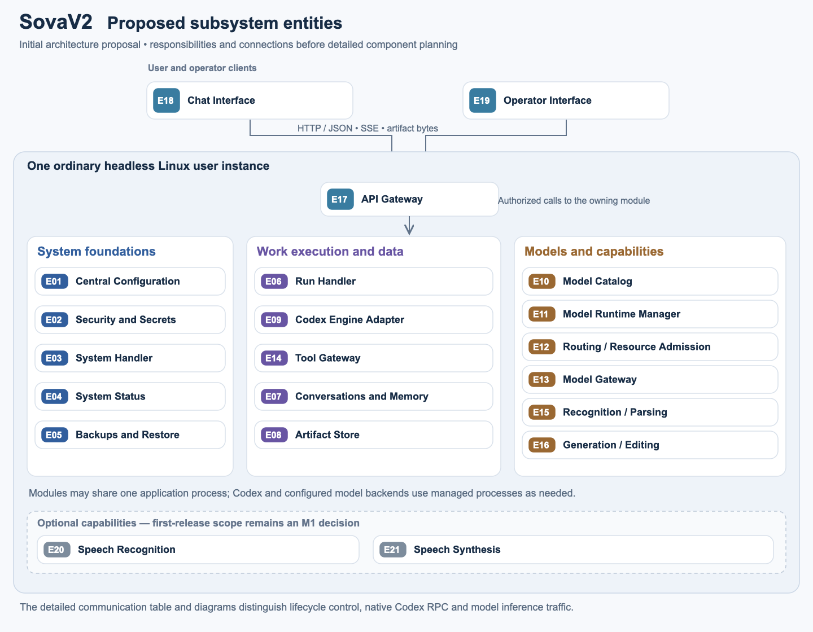
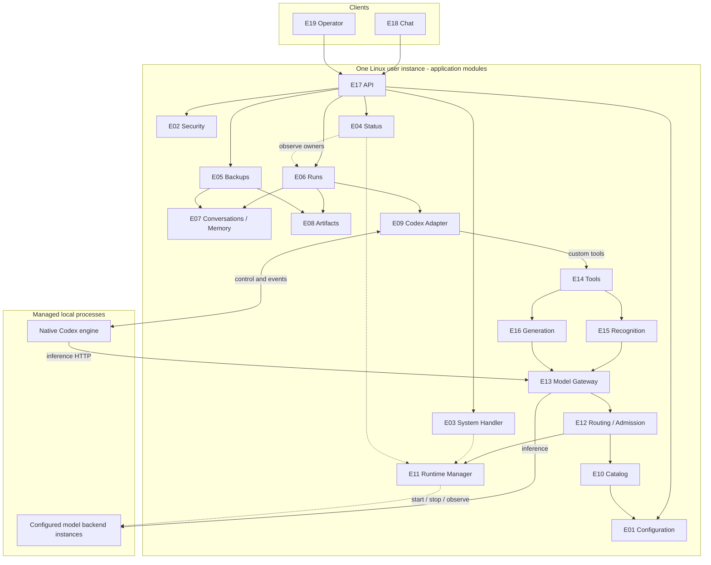
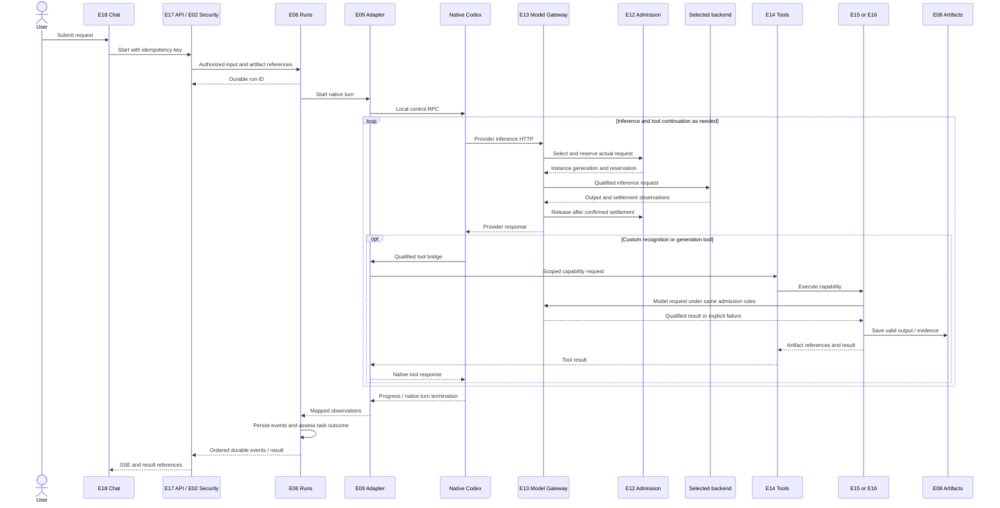
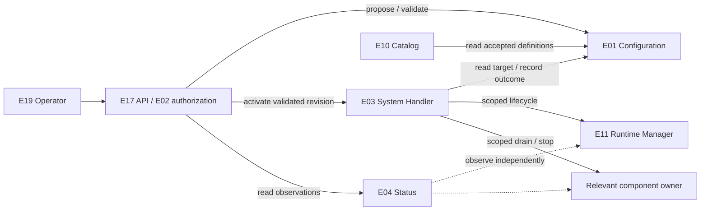
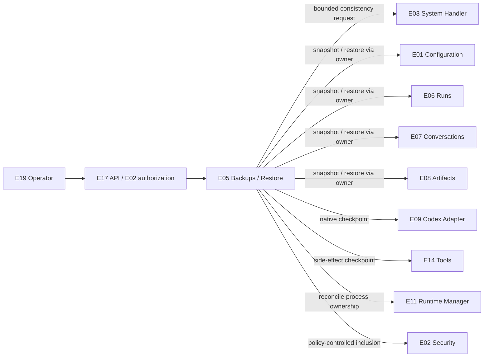

# Proposed SovaV2 subsystem entities

**Status: initial architecture proposal for discussion.** This document establishes the entity list, ownership and basic connections. It does not complete M1–M5, implement modules or freeze every protocol/schema choice.

An **entity** is a logical subsystem with one responsibility, owned state, an explicit interface and its own direct tests. Entities can live together in one application process. A separate entity does not automatically mean a separate service, database or network listener.

The baseline is one ordinary user instance on a single headless Linux system. The chat and operator interfaces are clients of that instance. Codex and selected model runtimes may require managed child processes. Additional machines, fixed accelerators and fixed model families are not architectural requirements.

## Proposed entity list

There are **19 core logical entities** and **two optional speech entities**. Core describes responsibility boundaries, not a requirement to load every model at startup. Enabled capabilities and resources come from operator configuration; first-release modality scope is decided in M1.

### System foundations

| ID / module key | Entity | Responsibility and authoritative state |
| --- | --- | --- |
| E01 / `configuration` | Central System Configuration | The single editable source of deployment intent: enabled capabilities, model/runtime definitions, routing, limits, storage and policy references. Owns validated configuration revisions and activation records. Consumers receive scoped effective views; no competing editable service configuration. |
| E02 / `security` | Security and Secrets | Authentication, authorization, protected secret resolution and capability grants. Applies E01's active access-policy intent; owns protected identities, secret handles and issued grant records, not a second editable policy file. Supplies only the secret needed by an authorized consumer. Raw credentials never enter chat, status, artifacts or ordinary logs. |
| E03 / `system_handler` | System Handler | Coordinates finite application start, stop, configuration activation and maintenance operations. Owns system-operation state and delegates actions to their actual owners. It does not own AI runs or route ordinary inference. |
| E04 / `system_status` | System Status | Aggregates component health, readiness, capacity summaries and operation progress. Owns timestamped observations and freshness, not deployment intent or model reservations. Observation continues while a component is maintained. |
| E05 / `backups` | System Backups and Restore | Coordinates consistent snapshots and restore through each state owner's interface. Owns backup manifests, integrity checks and restore results. Includes configuration, durable user data and required native state; model assets and secrets follow an explicit inclusion policy. |

### Work execution and retained data

| ID / module key | Entity | Responsibility and authoritative state |
| --- | --- | --- |
| E06 / `runs` | Run Handler | Owns durable AI run/job state, request idempotency, deadlines, cancellation coordination and ordered progress events. Work survives client disconnect. Tracks task outcome separately from native turn completion and computation settlement. |
| E07 / `conversations` | Conversations and Memory | Owns original conversation records, retrieval indexes and versioned memory/continuation material. Preserves superseded decisions and artifacts by reference. Works with the Codex Adapter for compaction; it does not run a competing agent loop. |
| E08 / `artifacts` | Artifact Store | Owns uploaded and generated bytes, metadata, versions, integrity and scoped read/write access. Other entities retain artifact references rather than copying files or maintaining another artifact index. |
| E09 / `codex_adapter` | Codex Engine Adapter | Owns the mapping of Sova runs/conversations to native Codex threads, turns, children, tools and compaction events. Drives the native engine and reports observations to Runs. Native execution/context remains owned by Codex; the adapter does not reimplement its reasoning loop. |
| E14 / `tools` | Tool Gateway | Exposes custom Sova tools, validates calls, enforces scoped execution/artifact grants issued or validated by E02 and tracks tool-side effects and settlement. Native Codex shell/file tools remain native, subject to enforced workspace, network and runtime constraints; they are not silently assumed to pass through this gateway. |

### Models and specialist capabilities

| ID / module key | Entity | Responsibility and authoritative state |
| --- | --- | --- |
| E10 / `model_catalog` | Model Catalog | A read projection of E01's active validated effective model/runtime definitions, capability declarations and compatibility information. Owns its derived view only; a validated but staged candidate is not routing authority. Actual loaded instances and readiness belong to E11, not this catalog. |
| E11 / `model_runtime` | Model Runtime Manager | Owns actual model-instance process generations, endpoints, resource assignments, startup/shutdown and recovery. Manages inference backend processes; it does not decide user tasks or serialize all inference through a lifecycle lock. |
| E12 / `routing` | Routing and Resource Admission | Selects eligible capabilities/models/instances under operator policy. Owns bounded queues, fairness and the single atomic resource-reservation ledger for inference, constrained tools, runtime residency and conflicting maintenance operations. Actual process facts remain E11-owned; a dashboard health cache is not admission authority. |
| E13 / `model_gateway` | Model Gateway | Owns model-provider protocol adaptation, backend request streaming, cancellation and confirmed settlement. Obtains admission for each actual request, calls the selected backend endpoint, and translates only supported/qualified protocol features. |
| E15 / `recognition` | Recognition and Document Parsing | Owns recognition/parsing tasks and typed evidence: exact text/labels/units, regions, source references and uncertainty. Calls configured models/parsers through the appropriate gateway and returns observations/artifacts. |
| E16 / `generation` | Image Generation and Editing | Owns generation/edit tasks, input references, validated decoded outputs and saved artifact results. Uses independently configured runtimes; recognition availability is not a prerequisite. |

### User and operator access

| ID / module key | Entity | Responsibility and authoritative state |
| --- | --- | --- |
| E17 / `api` | API Gateway | Authenticates and validates external requests, dispatches them to the owning entity, streams retained events and transfers authorized artifact bytes. Owns connection/request handling, not run lifetime or user history. |
| E18 / `chat` | Chat Interface | Presents messages, uploads, tool/artifact results and explicit commands. Owns client presentation and reconnect cursors. Ordinary chat uses automatic model/tool selection and contains no internal configuration clutter. |
| E19 / `operator` | Operator Interface | Provides an operator UI and/or CLI for configuration, status, lifecycle operations and backups. Stores no second authoritative configuration. This control surface is separate from ordinary chat. |

### Optional capability entities

| ID / module key | Entity | Scope |
| --- | --- | --- |
| E20 / `speech_recognition` | Speech Recognition | Converts authorized audio inputs into transcripts with provenance and uncertainty. Optional independently enabled capability; uses E08, E13 and E14. |
| E21 / `speech_synthesis` | Speech Synthesis | Converts text into saved playable audio artifacts. Optional independently enabled capability; uses E08, E13 and E14. |

Installation, upgrades and the test runner are planning/development concerns, not additional always-running product entities. Shared logging, schema validation and persistence helpers are libraries beneath the owning entities unless a later requirement justifies a distinct boundary.

## Basic entity map

[Editable vector diagram](diagrams/entity-map.svg). This overview groups the entities; the diagrams below show their important call paths.

The diagrams show selected important paths; the connection table below is the proposed adjacency map. Solid arrows are calls or event delivery; dashed arrows are observation or lifecycle actions. A backend instance is a process owned by E11, not an additional fixed Sova subsystem.

The native engine has two distinct links: **control/events through E09** and **inference through E13**. Model Gateway and Routing can be separate modules in the same process. Lifecycle control is not on the ordinary inference data path.

## Candidate protocol families

These are the proposed transport boundaries. Exact method names, executable schemas, compatibility versions and limits are M3–M4 planning work; no server or protocol implementation is included here.

| ID | Boundary | Proposed protocol |
| --- | --- | --- |
| P1 | Modules in the same application process | Versioned typed asynchronous command/query interfaces with explicit caller context, deadlines and structured results/errors. Domain notifications go directly to named consumers; no mandatory message broker. |
| P2 | Chat/operator clients to API | HTTP with JSON commands/queries and authenticated access. Use protected transport when exposed beyond the local trusted boundary. A client disconnect does not cancel a run. |
| P3 | API to observing clients | Server-Sent Events carrying already durable ordered run events. Reconnect supplies an event cursor; duplicates/gaps have explicit handling. HTTP queries recover current state/results. |
| P4 | E09 to native Codex | Bidirectional native App Server JSON-RPC over local stdio, with newline-delimited messages. Pin the upstream version and its generated schemas; qualify any experimental feature used. |
| P5 | Native Codex to E13 | Local HTTP Responses-compatible provider interface, bound to the correct Sova run/request context. Native control RPC and model-provider HTTP are different protocols. |
| P6 | E13 to configured backend instances | The model/runtime's qualified inference protocol, normally HTTP request/stream semantics. Text, vision, image and speech payloads are capability-specific. Unsupported translation is rejected, not silently approximated. |
| P7 | Custom tools to external tool adapters | P1 internally; an explicitly qualified MCP or native tool-call bridge when a process boundary requires it. Built-in tools retain native execution constraints and observation. |
| P8 | Authorized artifact upload/download | Ordinary HTTP byte transfer at E17; scoped artifact references/streams through E08 internally. An arbitrary local path is not an artifact-access grant. |
| P9 | E05 to state owners | P1 snapshot/restore interfaces using a versioned manifest, consistency boundary and integrity checks. Archive format, encryption and restore policy are planned in M3–M4. |

The current official [Codex App Server documentation](https://learn.chatgpt.com/docs/app-server) describes stdio JSON-RPC, version-specific generated schemas and experimental custom-tool features. The [provider configuration reference](https://learn.chatgpt.com/docs/config-file/config-reference) currently lists `responses` as the provider wire protocol. These support the P4/P5 proposal; they do not prove compatibility with every local runtime or production readiness. Sova must qualify the selected upstream baseline and each backend adapter.

## Who communicates with whom

The left side initiates the call/subscription; replies or result streams return on that connection. This list defines proposed legitimate relationships, not unrestricted mutual access. Only the owner mutates its domain's state.

| Caller | Target | Purpose | Protocol |
| --- | --- | --- | --- |
| E18 Chat; E19 Operator | E17 API | User commands, operator commands, queries and reconnect | P2 / P3 / P8 |
| E17 API | E02 Security | Authenticate, authorize and bind request capabilities | P1 |
| E17 API | E06 Runs | Start, inspect and cancel a run; subscribe to its retained events | P1 |
| E17 API | E07 Conversations; E08 Artifacts | Authorized history queries, uploads and downloads | P1 / P8 |
| E17 API | E01 Configuration; E03 System Handler; E04 Status; E05 Backups | Authorized configuration proposals, activation/lifecycle commands, observation and backup/restore commands | P1 |
| E03 System Handler | E01 Configuration | Read the validated target revision and record activation through its owner | P1 |
| E03 System Handler | E06 Runs; E09 Codex Adapter; E11 Runtime Manager; E14 Tools; E15 Recognition; E16 Generation | Finite scoped start/stop, drain and maintenance coordination; act only on owned/conflicting resources | P1 |
| E03 System Handler; E11 Runtime Manager | E12 Routing and Admission | Obtain or validate the one resource-scoped reservation for a lifecycle/maintenance action; pass that operation's reservation to its executor | P1 |
| E10 Catalog | E01 Configuration | Read active validated effective model/runtime/capability definitions | P1 |
| Backend entities with configuration needs | E01 Configuration | Read only their scoped effective configuration and revision notifications; clients receive sanitized views via E17 | P1 |
| Authorized credential consumers | E02 Security | Resolve a needed secret or validate a capability grant; never pass all secrets to the model | P1 |
| E04 Status | Component owners | Read timestamped status, freshness and sanitized operational summaries; no mutation authority | P1 |
| E05 Backups | E01 Configuration; E02 Security; E06 Runs; E07 Conversations; E08 Artifacts; E09 Codex Adapter; E11 Runtime Manager; E14 Tools | Coordinate consistent export/restore with policy-aware secret inclusion, native-state capture, side-effect checkpoints and runtime reconciliation | P9 |
| E05 Backups | E03 System Handler | Request a bounded consistency/maintenance operation for the affected resources | P1 |
| E06 Runs | E07 Conversations | Append original run inputs/results through the history owner and retrieve continuation material | P1 |
| E06 Runs | E08 Artifacts | Validate input references and retain output references | P1 |
| E06 Runs | E09 Codex Adapter | Start/resume/interrupt native work; receive mapped native progress and terminal observations | P1 |
| E06 Runs | E14 Tools | Inspect/cancel run-owned custom tool work and reconcile side effects | P1 |
| E06 Runs; E09 Codex Adapter | E13 Model Gateway | Propagate run/request cancellation and reconcile backend settlement when native interruption is insufficient | P1 |
| E09 Codex Adapter | E07 Conversations | Coordinate native compaction/history synchronization and retained continuation material | P1 |
| E09 Codex Adapter | E02 Security | Obtain constrained runtime permissions and run-bound provider credentials | P1 |
| E09 Codex Adapter | Native Codex child | Drive native threads/turns; handle native events, permission requests and qualified tool bridges | P4 |
| Native Codex child | E13 Model Gateway | Text/reasoning, child-agent and compaction inference requests | P5 |
| E09 Codex Adapter | E14 Tools | Dispatch qualified custom Sova tool calls internally and return their results through the native P4 bridge | P1 |
| E14 Tools | E08 Artifacts; E07 Conversations | Resolve authorized file/history references for a tool call | P1 |
| E14 Tools | E15 Recognition; E16 Generation; enabled E20/E21 Speech | Dispatch capability work with run/task identity and grants; return evidence/output references | P1 |
| E14 Tools | E12 Routing and Admission | Reserve resources for actual constrained tool execution; model requests use E13's reservation rather than a duplicate tool reservation | P1 |
| E13 Model Gateway | E12 Routing and Admission | Resolve eligible instance and acquire/release one reservation for each actual backend request | P1 |
| E12 Routing and Admission | E10 Catalog; E11 Runtime Manager | Read compatibility/policy projections and current instance generation/readiness/capacity observations | P1 |
| E11 Runtime Manager | Backend processes | Resource-scoped start/stop, current owner/endpoint observation and recovery | Runtime-specific lifecycle contract |
| E11 Runtime Manager | E12 Routing and Admission; E13 Model Gateway | Notify current instance-generation/readiness changes so stale assignments are rejected and affected work is reconciled | P1 |
| E13 Model Gateway | Selected backend endpoint | Submit/stream inference; request cancellation and observe actual settlement | P6 |
| E15 Recognition; E16 Generation; enabled E20/E21 Speech | E13 Model Gateway | Execute configured model capability; all model work participates in admission | P1, then P6 |
| E15 Recognition; E16 Generation; enabled E20/E21 Speech | E08 Artifacts | Read authorized inputs and save outputs/evidence | P1 |
| E15 Recognition | Qualified parser adapters | Deterministic parsing or decoding under scoped resources/permissions | P1 / P7 |

E06/E09 cancellation also reaches E13 by run/request identity where native interruption does not confirm backend settlement. The exact native-request binding and cancellation propagation contract is a required M4 design decision; closing the HTTP stream alone cannot release capacity.

No ordinary request must traverse E03's maintenance queue. E15 and E16 have no readiness dependency on one another. Consumers read E04 for presentation; admission reads current authority from E11 and its own reservation records. Generation-change notifications aid reconciliation; E12/E13 still verify the current instance generation at admission and dispatch rather than treating notification delivery as race prevention.

## Three important flows

### Ordinary chat and a custom capability

The specialist branch is conditional; a text answer does not wait for an unrelated specialist. If the browser closes, E06 keeps the run. Reconnection reads durable events after a cursor and does not submit the work again.

### Configuration, lifecycle and independent status

Validation, preparation, activation and rollback still need an exact M3/M4 transaction contract. Until then, a proposed configuration is not assumed active. Observation requires no global mutation lock, and unrelated capabilities remain available when their actual resources are unaffected.

### Consistent backup and controlled restore

A backup is qualified only when its consistency boundary, manifest and restore checks agree. Restore occurs into a controlled target or stopped owned state, validates compatibility/integrity before activation, and reconciles interrupted runs, tool side effects and current model ownership. Effects performed after the backup cut may be missing from restored records; uncertain work must not be automatically replayed. Restore establishes a new data lineage and makes clients resynchronize stale event cursors. Historical live PIDs, health observations and reservations are never restored as current authority. Backup work does not hold a global lock while waiting indefinitely for a run.

## Boundary rules carried forward from V1

1. **One owner per kind of state.** No second editable model registry, duplicated authoritative run state or competing context manager. E12 is the single resource-reservation authority; there is no additional arbiter ledger. Native state, Sova run history and artifact bytes are distinct domains with explicit synchronization.
2. **Scoped control, independent observation.** System Handler coordinates finite actions; component owners mutate their own resources. Status refresh does not wait behind maintenance or backup mutations.
3. **All inference is accounted for.** E13/E12 cover primary, native child, compaction and specialist requests. Reservations reflect actual settled work; uncertain cancellation remains uncertain. Do not silently switch models after partial output has streamed.
4. **Independent capabilities.** Recognition failure does not make generation unready, and specialist maintenance does not block text unless there is a documented real resource conflict.
5. **Durable product outcomes.** Native completion, completed tool side effects, user task fulfillment and resource release are separate observations. Reconnect/recovery reconcile durable state rather than replaying uncertain effects.
6. **Small assembly.** Modules use direct typed contracts by default. Shared database/filesystem libraries may support separate owner namespaces; there is no new generic storage service or event-bus process solely to connect them.

These boundaries respond to the observed coupling and unfinished-work failures in the [V1 postmortem](https://github.com/djeZo888/mixed-memory-llm-api-server/blob/9481c1fda160b03d414a05c6ae741c34d2bb4dcf/docs/POSTMORTEM.md). They remain proposals to validate through the detailed plan and direct tests.

## Decisions for the next planning pass

- Confirm the entity list and first-release capabilities, including optional speech scope.
- Specify each entity's public operations, state schema, failure cases and direct test contract; choose module packaging/language and the minimal process assembly.
- Choose the Codex upstream baseline, qualified custom-tool route and native tool constraints; define native/Sova history synchronization and provider-request binding to run/reservation identity.
- Define enforceable filesystem/network/tool boundaries under the ordinary Linux user. Module calls and a shared user identity alone are not an isolation boundary for arbitrary shell commands; native and custom tools must use the chosen enforced sandbox/grants.
- Specify configuration preparation/activation/rollback and model compatibility qualification, without hard-coding a deployment or model.
- Define exact request/event versions, artifact grants, cancellation settlement, backup consistency/inclusion and restore reconciliation.

These belong to the detailed M1–M5 plan. This first document establishes the proposed entities and their relationships so those choices can be discussed before expansion.
